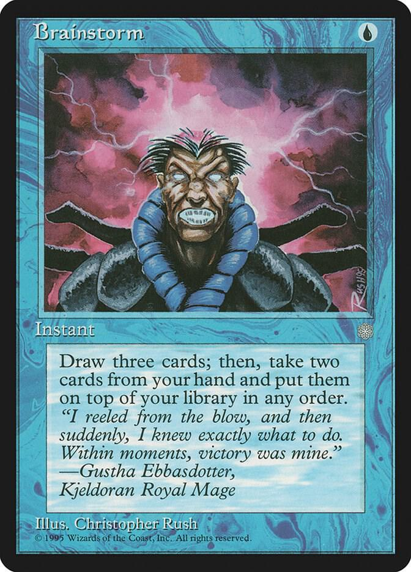

# Brainstorm


Tools for keep your skills sharp. As AI coding tools become more popular, powerful and useful it becomes more challenging to keep core skills sharp. The goal here is to help do that.

# Brainstorm - Setup Guide

## Requirements

Create a `requirements.txt` file:

```txt
langchain>=0.1.0
langchain-community>=0.0.10
langchainhub>=0.1.20
langchain-ollama>=0.1.4
ollama>=0.1.7
arxiv>=2.1.0
requests>=2.31.0
beautifulsoup4>=4.12.0
chromadb>=0.4.22
numpy>=1.24.0
```

## Installation Steps

### 1. Install Ollama
```bash
# macOS
brew install ollama

# Linux
curl -fsSL https://ollama.ai/install.sh | sh

# Windows
# Download from https://ollama.com/download
```

### 2. Start Ollama and Pull a Model
```bash
# Start Ollama service
ollama serve

# In another terminal, pull a model (choose one):
ollama pull llama3.2          # 3B model, good balance
ollama pull mistral           # 7B model, fast
ollama pull codellama         # Specialized for code
ollama pull phi3              # Small and fast
ollama pull mixtral           # Larger, more capable
```

### 3. Setup Python Environment
- **Install uv:**
Various options here, see [installation guide](https://docs.astral.sh/uv/getting-started/installation/#pypi)
  ```bash
  brew install uv
  ```
- **Create a virtual environment:**
  ```bash
  uv venv
  ```
- **Activate the virtual environment:**
  - On macOS and Linux:
    ```bash
    source .venv/bin/activate
    ```
  - On Windows:
    ```bash
    .venv\Scripts\activate.bat
    ```
- **Install dependencies:**
  ```bash
  uv pip install -r requirements.txt
  ```

### 4. Run Brainstorm
```bash
python main.py
```

## Configuration

The system creates a `config.json` on first run. You can modify:

```json
{
  "ollama_model": "llama3.2",      // Change to any Ollama model
  "ollama_base_url": "http://localhost:11434",
  "arxiv_max_results": 20,         // Papers to fetch
  "weeks_lookback": 2,              // How far back to search
  "db_path": "./brainstorm_db",
  "challenges_path": "./challenges",
  "papers_cache_path": "./papers_cache"
}
```

## Usage Examples

### Interactive CLI Mode
```bash
python main.py
```

Then use natural language commands:
- "Show me papers from the last 3 weeks"
- "discover trends in AI tools"
- "Give me a medium difficulty coding challenge"
- "generate challenge on python decorators"
- "I need a hint for challenge attention_impl"
- "Let's discuss transformer architectures"
- "Explain LoRA fine-tuning"

### Python API Usage
```python
from agent import BrainstormAgent
from config import Config

# Custom configuration
config = Config(
    ollama_model="codellama",
    weeks_lookback=4
)

# Create agent
agent = BrainstormAgent(config)

# Get recent papers
response = agent.run("Find me recent papers on efficient LLM training")
print(response)

# Discover trends
response = agent.run("discover trends in MLOps platforms")
print(response)

# Get a coding challenge
response = agent.run("Give me a hard coding challenge about transformers")
print(response)

# Discuss topics
response = agent.run("Explain how FlashAttention works")
print(response)
```

## Project Structure

```
brainstorm/
├── main.py                 # CLI entry point
├── agent.py                # BrainstormAgent orchestrator
├── config.py               # Config class
├── llm_provider.py         # LLM initialization
├── tools/                  # Tool modules
│   ├── __init__.py
│   ├── paper_discovery.py
│   ├── coding_challenge.py
│   ├── discussion.py
│   └── trends_discovery.py
├── challenges/             # Directory for coding challenges
│   └── .gitkeep
├── papers_cache/           # Cached paper data
├── brainstorm_db/          # Vector database storage
├── requirements.txt        # Python dependencies
├── config.json             # Configuration (auto-created)
└── README.md               # This file
```

## Extending Brainstorm

### Adding New Challenges

To add a new challenge, create a new JSON file in the `challenges/` directory. The JSON file should have the following structure:

```json
{
    "id": "your_challenge_id",
    "title": "Challenge Title",
    "difficulty": "medium",
    "category": "category",
    "description": "Full description...",
    "hints": ["Hint 1", "Hint 2"],
    "test_cases": "Optional test code"
}
```

You can also use the `generate challenge` command to have the LLM create a new challenge for you.

### Adding Custom Tools

Add new tools to the agent in `agent.py` in the `_setup_agent()` method:

```python
tools.append(Tool(
    name="custom_tool",
    func=lambda x: your_function(x),
    description="What this tool does"
))
```

### Changing Paper Sources

Modify `search_recent_papers()` in `tools/paper_discovery.py` to add more sources beyond arXiv.

### Using Different Embeddings

Change the embeddings model in `tools/discussion.py`:

```python
self.embeddings = OllamaEmbeddings(
    model="nomic-embed-text",  # Or any embedding model
    base_url=config.ollama_base_url
)
```

## Recommended Models by Use Case

- **General Use**: `llama3.2` or `mistral`
- **Code Focus**: `codellama` or `deepseek-coder`
- **Fast Responses**: `phi3` or `tinyllama`
- **Best Quality**: `mixtral` or `llama3.1:70b` (needs more RAM)
- **Embeddings**: `nomic-embed-text` or `all-minilm`

## Troubleshooting

### Ollama Connection Error
- Ensure Ollama is running: `ollama serve`
- Check the port: default is 11434
- Verify model is pulled: `ollama list`

### Memory Issues
- Use smaller models (phi3, tinyllama)
- Reduce `arxiv_max_results` in config
- Clear vector database periodically

### Slow Responses
- Use faster models
- Reduce agent `max_iterations`
- Consider GPU acceleration for Ollama

## Future Enhancements

- [x] Add dynamic aspect to CodingChallenge where challenge questions are generated by the LLM
- [x] Popular new tool search
- [ ] Popular online course search on a topic
- [ ] Web UI with Gradio/Streamlit
- [ ] GitHub integration for code challenges
- [ ] Paper summarization with citations
- [ ] Progress tracking and spaced repetition
- [ ] Custom challenge creation UI
- [ ] Multi-user support with profiles
- [ ] Integration with Jupyter notebooks
- [ ] Export learning reports

## License

MIT License - Feel free to modify and extend!